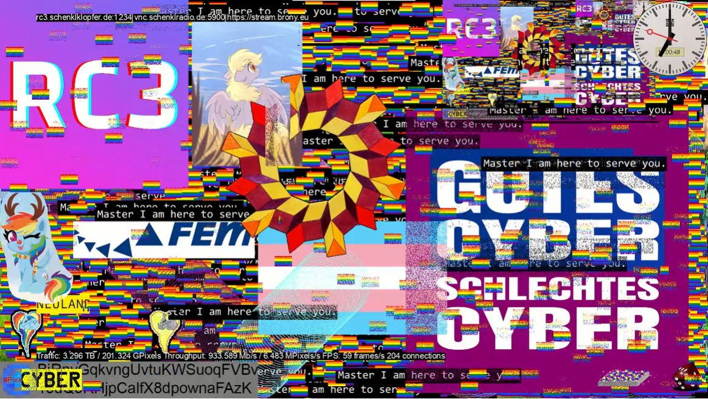
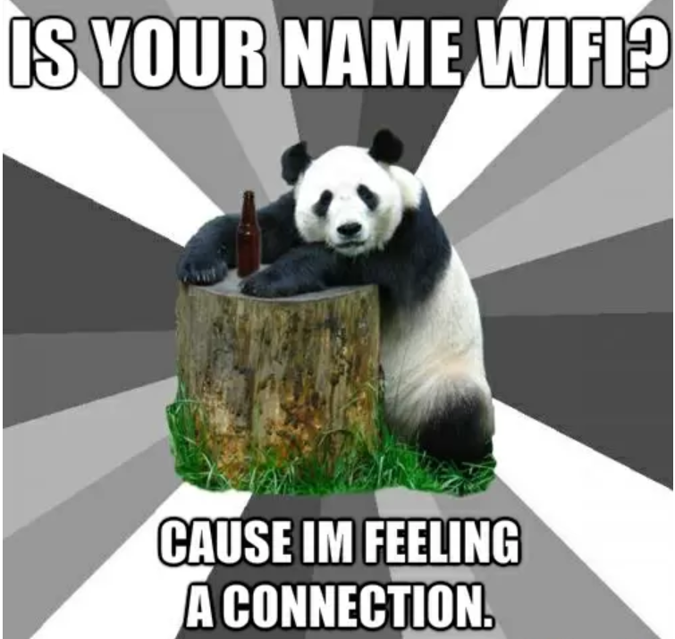
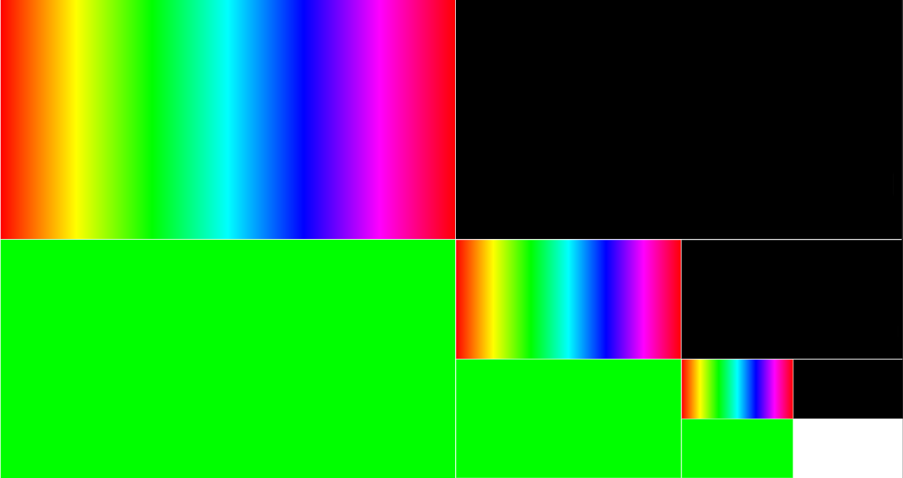
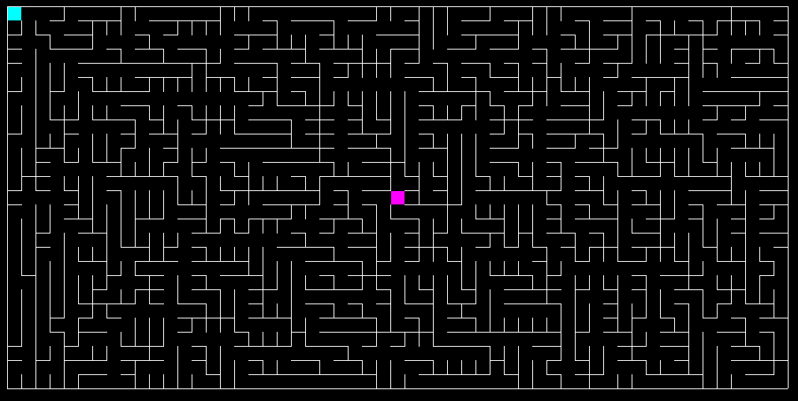
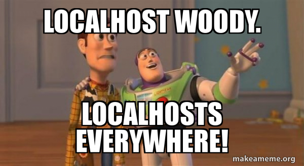
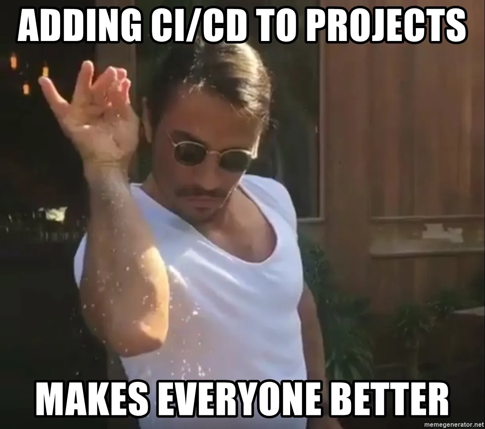
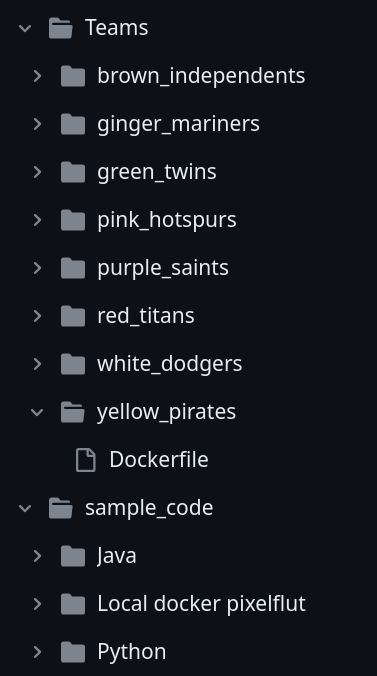
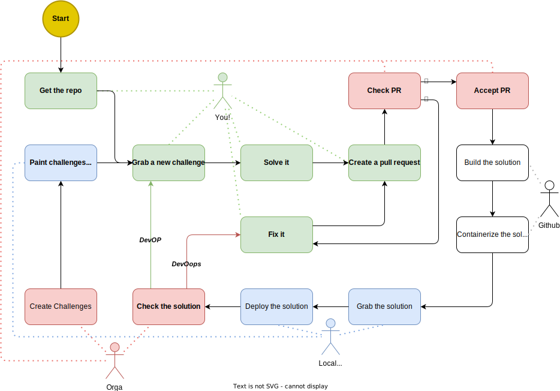

:css: style.css

.. title:: Hacktoberfest 2023

----

:data-x: r2100
:data-y: 0
:class: cover-class

Hacktoberfest 2023
==================

O`zapft is! Ab in die Container
-------------------------------

Markus Pöschl & Alex Mayer

.. note::

  To remove the title image, remove the image on the cover slide

----

:class: right-class

What will happen now
--------------------

* 📍 You are here
* 🎤 Challange Explanations
* 🎤 GitHub Worklow Demo
* 🍴 Buffet starting around 7:45 PM (Also vegitarian)
* 🐱‍💻 Challenge time
* 🚪 Official end is 11 PM

.. image:: images/menu.png
   :width: 500px
   :height: 500px

----

:class: full-slide-class

----

:class: right-class

.. image:: images/hacktoberfest.png
    :width: 800px

Hacktoberfest
=============

* As every year GitHub encourage developers for open-source work.
* 4 Pull Requests must be made on repositories with the label `hacktoberfest`
* The PR's must be approved to count after a grace period of 7 days
* You will get a digital avard after completing

**And you need to be registered:** https://hacktoberfest.com/

----

:class: right-class

What will be doing today?
=========================

1. One FullHD Pixelflut Server + one testing server
2. Five Challenges
3. Complete some Pull Requests
4. Try to be the first one solving the maze

----

:class: right-class

Connectivity
============

Of course you can network (talk to people, share socials and stuff)

But sometimes you NEED network

* Use the wired connection
* WiFi:
    * SSID: restricted | Pass: restricted
    * For our colleges:
        Please also use **this** WiFi!

----

:class: right-class

The Pixelflut protocol
======================

* ``\n`` terminated ASCII commands over TCP
* 3 commands
    * `HELP`
    * `SIZE`
    * `PX`

.. code-block:: bash

    echo "HELP" | netcat 10.201.77.160 1234

    echo "SIZE" | netcat 10.201.77.160 1234

    echo "PX {x} {y}" | netcat 10.201.77.160 1234
    echo "PX {x} {y} {rrggbb}" | netcat 10.201.77.160 1234
    echo "PX {x} {y} {rrggbb}\nPX {x} {y} {rrggbb}" \
        | netcat 10.201.77.160 1234

----

:data-x: r0
:data-y: r1100
:class: right-class

.. image:: images/areas.png
    :width: 800px

Areas
=====

* The canvas is split into 9 equal areas
* Each group canvas therefore is 
    ``(1920 / 3) x (1080 / 3)``
* Each group canvas is split into four challenge areas.
* On the sides of each area is a ``1px`` border.

----

:data-x: r2100
:data-y: r0
:class: full-slide-class

.. image:: images/areas.png

----

:data-x: r0
:data-y: r1100
:class: right-class

.. image:: images/challenge.jpg
   :width: 600px

Challenges
==========

1. Color Spectrum
2. "Deal with it"
3. "Inception"
4. "Cube Mover"
5. Solve the maze

----

:data-x: r2100
:data-y: r0
:class: right-class

.. image:: images/rgb.png

Color Spectrum
==============

* Draw the color spectrum of the RGB range
    (or a other color space)
* Loops endless

----

:class: right-class

.. image:: images/deal-with-raccon.png

"Deal with it"
==============

* Search a random animal picture and draw it
* Use the provided glasses .png
* Animate them moving down to the eyes of the animal
* Background has to be restored behind the moving animation

Glasses:

.. image:: images/thug.jpg
   :class: inline-class
   :width: 120px

https://github.com/HacktoberfestMunich/Hacktoberfest-2023/presentation/images/thug.jpg

----

:class: right-class

"Inception"
===========

* Copy the content of your group area an paint it in on quarter.
* Scale it to the size of your target area.
* Solution should be sharp as a pixel!

----

:class: right-class

"Cube Mover"
============

* A cube will move around in one of your areas
* Draw a border around that moving cube
* Update it with the cube movement

----

:class: right-class

Maze
====

* Solve the maze
* It gets regenerated on a fixed interval (5 seconds)
* Draw a line from start to the end
* The space inside one cell is ``16 x 16 px``
* Color of the start patch: ``#00FFFF``
* Color of the finish patch: ``#FF00FF``
* Background is: ``#000000``

----

:data-x: r0
:data-y: r1100
:class: right-class

.. image:: images/rules.jpg
   :height: 600px

Rules
=====

* Only use the group area of your team. (Find your team now 🙂)
* There is a ``1px`` white border around your group area. Don't overwrite it.
* Open one TCP connection per machine and reuse it!
* All challanges needs to be updated simultaneously.
* Please speak to us when the first four challenges are solved and you are starting the maze. 

----

:class: right-class
:data-x: r2400
:data-y: r0

Playground - Server
===================

* IP: ``10.201.77.104``
* Port: ``1234``

Challenge - Server
==================

* IP: ``127.0.0.1`` (???)
* Port: ``1234``

----

:data-x: r0
:data-y: r1100
:class: right-class

GitHub Workflow
===============

* Pull Requests on GitHub will trigger CI
* We run container on the Pixelflut host
* They will "play"

----

:class: right-class
:data-x: r2400
:data-y: r0

The repository
==============

* We prepared a repository on GitHub
    https://github.com/HacktoberfestMunich/Hacktoberfest-2023
* Team folders with names
    * Your solution needs to be in a Docker image build by the
* Example code for Java and Python
* Dockerfile for both of them

----

Demo-Time
=========

----

:class: full-slide-class

----

:class: right-class
:data-x: r0
:data-y: r1100

Summary
=======

1. Register to Hacktoberfest
2. Get Repository from https://github.com/HacktoberfestMunich/Hacktoberfest-2023
3. Goto your team
4. Use the test pixelflut server for ... testing
5. Submit your solution with the Dockerfile in a PR
6. We will accept it and CI will do some building
7. Your container will appear on the challange playground
8. Reach out to us after the first 4 challenges

WiFi
----

SSID: restricted | Pass: restricted

----

:class: right-class
:data-x: r2400
:data-y: r0

GLHF!
=====

(and feel free to ask!)
-----------------------

.. image:: images/mauled.jpg
